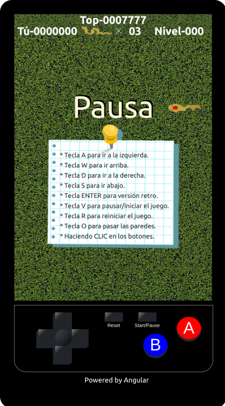

# sssnake - juego


## Descripción
> El juego clásico de la viborita desarrollado con la versión 13.1.1 de angular.
> El juego puede ser controlado tanto por el teclado como por el mouse.


## Descargar las dependencias
```
npm install
```

## Iniciar el proyecto
```
Ejecutar `ng serve` para un iniciar un servidor de desarrollo. Navegar a `http://localhost:4200/`.
```

## Construir el proyecto
```
Ejecutar `ng build` para construir el proyecto para produccion. El proyecto construido sera almacenado en la carpeta `dist/`.
```

## Captura de pantalla
<br>


## Ver juego

[Clic aquí](https://alvaro-7x.github.io/sssnake-juego/)


